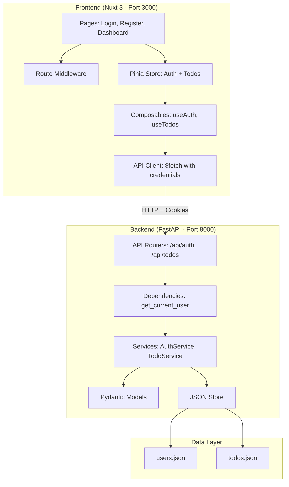
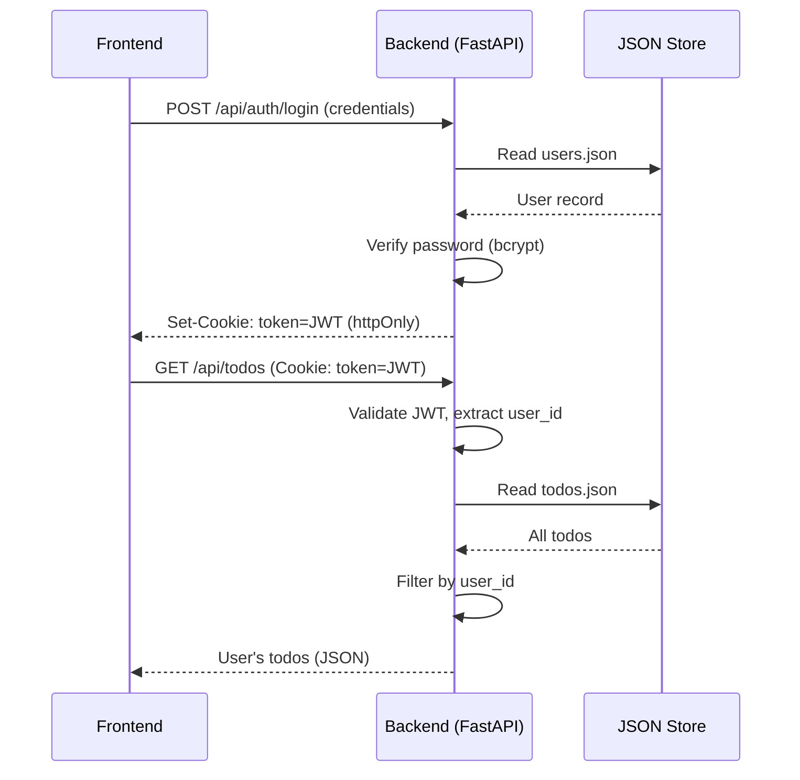

# Design Document: Full-Stack Todo Application

## Overview

This design describes a full-stack Todo application with a Python FastAPI backend and a Nuxt 3 frontend. The system provides user authentication via JWT tokens stored in httpOnly cookies, full CRUD operations on todo items with filtering/sorting, and a responsive dashboard UI.

The architecture follows a clean client-server separation:
- **Backend** (FastAPI): REST API at `http://localhost:8000` handling auth, todo CRUD, and JSON file persistence
- **Frontend** (Nuxt 3): SPA at `http://localhost:3000` with TailwindCSS, Pinia state management, and route guards

Key design decisions:
- **JSON file storage** over a database for simplicity and zero-dependency setup (workshop demo context)
- **httpOnly cookies** for JWT storage to prevent XSS token theft
- **bcrypt** for password hashing (industry standard, resistant to brute force)
- **Pydantic** for request/response validation on the backend
- **Nuxt middleware** for client-side route protection

## Architecture



### Request Flow



## Components and Interfaces

### Backend Components

#### 1. JSON Store (`backend/store.py`)

A file-based persistence layer that reads/writes JSON arrays.

```python
class JSONStore:
    def __init__(self, file_path: str):
        """Initialize store with path to JSON file."""

    def read_all(self) -> list[dict]:
        """Read all records. Creates file with [] if not exists."""

    def write_all(self, data: list[dict]) -> None:
        """Atomically write all records (write to temp, then rename)."""

    def find_by_id(self, record_id: str) -> dict | None:
        """Find a single record by id field."""

    def find_by_field(self, field: str, value: str) -> dict | None:
        """Find a single record by arbitrary field match."""

    def add(self, record: dict) -> dict:
        """Append a record and persist."""

    def update(self, record_id: str, updates: dict) -> dict | None:
        """Update fields on a record by id and persist."""

    def delete(self, record_id: str) -> bool:
        """Remove a record by id and persist."""
```

#### 2. Auth Service (`backend/services/auth_service.py`)

Handles registration, login, logout, and token management.

```python
class AuthService:
    def __init__(self, user_store: JSONStore):
        """Initialize with user store."""

    def register(self, email: str, username: str, password: str, password_confirm: str) -> User:
        """Register a new user. Raises ValidationError or ConflictError."""

    def login(self, identifier: str, password: str) -> User:
        """Authenticate by email or username. Raises UnauthorizedError."""

    def get_user_by_id(self, user_id: str) -> User | None:
        """Retrieve user by id for session validation."""

    def create_token(self, user_id: str) -> str:
        """Create a JWT with user_id claim and 24h expiry."""

    def verify_token(self, token: str) -> str:
        """Verify JWT signature and expiry, return user_id. Raises UnauthorizedError."""
```

#### 3. Todo Service (`backend/services/todo_service.py`)

Handles CRUD operations on todos scoped to the authenticated user.

```python
class TodoService:
    def __init__(self, todo_store: JSONStore):
        """Initialize with todo store."""

    def create(self, user_id: str, data: TodoCreate) -> Todo:
        """Create a todo for the user. Raises ValidationError."""

    def list_todos(self, user_id: str, status: str | None, priority: str | None, sort_by: str | None) -> list[Todo]:
        """List user's todos with optional filtering and sorting."""

    def get_by_id(self, user_id: str, todo_id: str) -> Todo:
        """Get a specific todo. Raises NotFoundError if missing or not owned."""

    def update(self, user_id: str, todo_id: str, data: TodoUpdate) -> Todo:
        """Update a todo. Raises NotFoundError or ValidationError."""

    def delete(self, user_id: str, todo_id: str) -> None:
        """Delete a todo. Raises NotFoundError if missing or not owned."""

    def get_stats(self, user_id: str) -> TodoStats:
        """Compute dashboard statistics for the user."""
```

#### 4. API Routers

- `backend/routers/auth.py`: POST /api/auth/register, POST /api/auth/login, POST /api/auth/logout, GET /api/auth/me
- `backend/routers/todos.py`: GET /api/todos, POST /api/todos, GET /api/todos/{id}, PUT /api/todos/{id}, DELETE /api/todos/{id}

#### 5. Dependencies (`backend/dependencies.py`)

```python
async def get_current_user(request: Request) -> User:
    """Extract and validate JWT from cookie, return User. Raises 401 on failure."""
```

### Frontend Components

#### 1. Pages

| Page | Route | Auth Required |
|------|-------|---------------|
| Login | `/login` | No (redirect to dashboard if authenticated) |
| Register | `/register` | No (redirect to dashboard if authenticated) |
| Dashboard | `/dashboard` | Yes |

#### 2. Pinia Stores

- **`stores/auth.ts`**: Manages user state, login/register/logout actions, `isAuthenticated` getter
- **`stores/todos.ts`**: Manages todo list, CRUD actions, filter/sort state, statistics getter

#### 3. Composables

- **`composables/useAuth.ts`**: Wraps auth store with form validation logic
- **`composables/useTodos.ts`**: Wraps todo store with optimistic updates and error handling

#### 4. Middleware

- **`middleware/auth.global.ts`**: Global route guard that checks auth state and redirects accordingly

#### 5. UI Components

- `components/TodoItem.vue`: Single todo with inline edit, status toggle, delete button
- `components/TodoList.vue`: Filtered/sorted list of TodoItems
- `components/TodoForm.vue`: Create/edit form (used in modal)
- `components/StatsCards.vue`: Dashboard statistics display
- `components/FilterBar.vue`: Status/priority filter and sort controls
- `components/ConfirmDialog.vue`: Reusable confirmation modal
- `components/Toast.vue`: Notification toast system
- `components/LoadingSkeleton.vue`: Skeleton placeholder during loading
- `components/EmptyState.vue`: Empty state illustration
- `components/DarkModeToggle.vue`: Theme toggle with localStorage persistence

## Data Models

### User Model

```python
from pydantic import BaseModel, EmailStr, Field
from datetime import datetime

class User(BaseModel):
    id: str                          # UUID4 string
    email: EmailStr                  # Valid email format
    username: str                    # 3-30 chars, alphanumeric + underscore
    password_hash: str               # bcrypt hash
    created_at: datetime             # ISO 8601 timestamp

class UserCreate(BaseModel):
    email: EmailStr
    username: str = Field(min_length=3, max_length=30, pattern=r'^[a-zA-Z0-9_]+$')
    password: str = Field(min_length=8)
    password_confirm: str

class UserResponse(BaseModel):
    id: str
    email: str
    username: str
    created_at: datetime
```

### Todo Model

```python
from enum import Enum

class Priority(str, Enum):
    LOW = "low"
    MEDIUM = "medium"
    HIGH = "high"

class Status(str, Enum):
    PENDING = "pending"
    IN_PROGRESS = "in-progress"
    DONE = "done"

class Todo(BaseModel):
    id: str                          # UUID4 string
    user_id: str                     # Reference to User.id
    title: str                       # 1-200 chars, non-whitespace-only
    description: str | None = None   # Optional, max 2000 chars
    priority: Priority = Priority.MEDIUM
    due_date: str | None = None      # ISO 8601 date (YYYY-MM-DD) or None
    status: Status = Status.PENDING
    reminder_at: datetime | None = None  # ISO 8601 datetime or None
    created_at: datetime
    updated_at: datetime | None = None

class TodoCreate(BaseModel):
    title: str = Field(min_length=1, max_length=200)
    description: str | None = Field(default=None, max_length=2000)
    priority: Priority = Priority.MEDIUM
    due_date: str | None = None      # Validated as YYYY-MM-DD
    status: Status = Status.PENDING
    reminder_at: str | None = None   # Validated as ISO 8601 datetime

class TodoUpdate(BaseModel):
    title: str | None = Field(default=None, min_length=1, max_length=200)
    description: str | None = Field(default=None, max_length=2000)
    priority: Priority | None = None
    due_date: str | None = None
    status: Status | None = None
    reminder_at: str | None = None   # ISO 8601 datetime or null to clear

class TodoStats(BaseModel):
    total: int
    completed: int
    pending: int
    overdue: int
```

### TypeScript Types (Frontend)

```typescript
interface User {
  id: string
  email: string
  username: string
  created_at: string
}

interface Todo {
  id: string
  user_id: string
  title: string
  description: string | null
  priority: 'low' | 'medium' | 'high'
  due_date: string | null
  status: 'pending' | 'in-progress' | 'done'
  reminder_at: string | null
  created_at: string
  updated_at: string | null
}

interface TodoStats {
  total: number
  completed: number
  pending: number
  overdue: number
}

type TodoCreate = Pick<Todo, 'title'> & Partial<Pick<Todo, 'description' | 'priority' | 'due_date' | 'status' | 'reminder_at'>>
type TodoUpdate = Partial<Pick<Todo, 'title' | 'description' | 'priority' | 'due_date' | 'status' | 'reminder_at'>>
```

### JSON File Schemas

**users.json**:
```json
[
  {
    "id": "uuid-string",
    "email": "user@example.com",
    "username": "john_doe",
    "password_hash": "$2b$12$...",
    "created_at": "2024-01-15T10:30:00Z"
  }
]
```

**todos.json**:
```json
[
  {
    "id": "uuid-string",
    "user_id": "user-uuid-string",
    "title": "Complete workshop",
    "description": "Finish the todo app workshop",
    "priority": "high",
    "due_date": "2024-02-01",
    "status": "in-progress",
    "reminder_at": "2024-01-31T09:00:00Z",
    "created_at": "2024-01-15T10:30:00Z",
    "updated_at": "2024-01-16T08:00:00Z"
  }
]
```

## Correctness Properties

*A property is a characteristic or behavior that should hold true across all valid executions of a system — essentially, a formal statement about what the system should do. Properties serve as the bridge between human-readable specifications and machine-verifiable correctness guarantees.*

### Property 1: Registration input validation

*For any* registration request where the password and password_confirm do not match, or the email is not in valid email format, or the username is not 3-30 alphanumeric/underscore characters, or the password is fewer than 8 characters, or any required field is missing, the Auth_Service SHALL return a 422 validation error and SHALL NOT create a user record.

**Validates: Requirements 1.1, 1.2, 1.5, 1.9**

### Property 2: Registration uniqueness enforcement

*For any* registration request where the email or username already exists in the JSON_Store, the Auth_Service SHALL return a 409 conflict error and SHALL NOT create a duplicate user record.

**Validates: Requirements 1.3, 1.4**

### Property 3: Registration creates correct user record with bcrypt hash

*For any* valid registration request, the Auth_Service SHALL create a User record where: the id is a unique UUID, the email and username match the input, the password_hash is a valid bcrypt hash that verifies against the original password, and created_at is a valid timestamp.

**Validates: Requirements 1.6, 1.7**

### Property 4: Successful authentication issues valid JWT

*For any* successful registration or login, the Auth_Service SHALL issue a JWT containing the user's id as a claim, with an expiration time of exactly 24 hours from issuance, and the token SHALL be verifiable with the server's secret key.

**Validates: Requirements 1.8, 2.1**

### Property 5: Invalid credentials return 401

*For any* login attempt where the identifier (email or username) does not exist in the store, or the password does not match the stored hash, the Auth_Service SHALL return a 401 unauthorized error with a generic "invalid credentials" message (not revealing which field was wrong).

**Validates: Requirements 2.2, 2.3**

### Property 6: JWT verification correctness

*For any* JWT token, if it has a valid signature, is not expired, and references an existing user_id, the verification SHALL succeed and return the correct user_id. For any JWT that is expired, has a tampered signature, is malformed, or references a non-existent user_id, the verification SHALL fail with a 401 error.

**Validates: Requirements 4.1, 4.2, 4.5**

### Property 7: Todo creation with correct fields and defaults

*For any* valid todo creation request with a title (and optional description, priority, due_date, status), the Todo_Service SHALL create a record with a unique id, the authenticated user's user_id, the provided title, priority defaulting to "medium" if not specified, status defaulting to "pending" if not specified, and a valid created_at timestamp.

**Validates: Requirements 5.1, 5.2, 5.3, 5.4**

### Property 8: Todo input validation rejects invalid data

*For any* todo create or update request where the title is empty, whitespace-only, or exceeds 200 characters, or the description exceeds 2000 characters, or the priority is not in {low, medium, high}, or the status is not in {pending, in-progress, done}, or the due_date is not a valid ISO 8601 date (YYYY-MM-DD), the Todo_Service SHALL return a 422 validation error and SHALL NOT modify the store.

**Validates: Requirements 5.5, 5.7, 5.8, 6.9, 7.5, 7.6, 7.7, 7.8**

### Property 9: User data isolation

*For any* authenticated user, all todo operations (list, get, update, delete) SHALL only succeed for todos where todo.user_id matches the authenticated user's id. Attempting to access, modify, or delete a todo belonging to a different user SHALL return a 404 not found error.

**Validates: Requirements 6.1, 6.7, 7.3, 8.3**

### Property 10: Filter correctness

*For any* set of todos belonging to a user, when a status filter is applied, all returned todos SHALL have a status matching the filter value. When a priority filter is applied, all returned todos SHALL have a priority matching the filter value. The result set SHALL be a subset of the user's todos.

**Validates: Requirements 6.2, 6.3**

### Property 11: Sort correctness

*For any* set of todos belonging to a user, when sorted by due_date, the result SHALL be in ascending date order with null due_dates placed last. When sorted by created_at, the result SHALL be in descending chronological order.

**Validates: Requirements 6.4, 6.5**

### Property 12: Update modifies only specified fields

*For any* valid update request with a subset of fields (title, description, priority, due_date, status), the Todo_Service SHALL modify only the provided fields, leave all other fields unchanged, and set updated_at to the current timestamp.

**Validates: Requirements 7.1**

### Property 13: Delete removes todo from store

*For any* todo belonging to the authenticated user, after a successful delete operation, the todo SHALL no longer exist in the JSON_Store, and subsequent attempts to retrieve it SHALL return 404.

**Validates: Requirements 8.1**

### Property 14: Statistics computation correctness

*For any* set of todos belonging to a user, the statistics SHALL satisfy: total equals the count of all user's todos, completed equals the count with status "done", pending equals the count with status "pending" or "in-progress", and overdue equals the count with due_date before today AND status not equal to "done".

**Validates: Requirements 9.1, 9.2, 9.3, 9.4**

### Property 15: Todo serialization round-trip

*For any* valid Todo object, serializing it to JSON and deserializing back SHALL produce an equivalent Todo object with all fields preserved.

**Validates: Requirements 14.6**

### Property 16: User serialization round-trip

*For any* valid User object, serializing it to JSON and deserializing back SHALL produce an equivalent User object with all fields preserved (excluding password_hash verification against the original password).

**Validates: Requirements 14.7**

### Property 17: ID uniqueness invariant

*For any* sequence of user registrations and todo creations, all generated User ids SHALL be unique across all users, all User emails SHALL be unique, all User usernames SHALL be unique, and all generated Todo ids SHALL be unique across all todos.

**Validates: Requirements 14.4, 14.5**

### Property 18: Atomic write prevents corruption

*For any* write operation to the JSON_Store that fails (simulated I/O error), the JSON file SHALL remain in its previous valid state (valid JSON array), and the Backend SHALL return a 500 internal server error.

**Validates: Requirements 14.8**

## Error Handling

### Backend Error Strategy

| Error Type | HTTP Status | Response Format |
|-----------|-------------|-----------------|
| Validation Error | 422 | `{"detail": [{"field": "email", "message": "Invalid email format"}]}` |
| Conflict Error | 409 | `{"detail": "Email already registered"}` |
| Unauthorized Error | 401 | `{"detail": "Invalid credentials"}` |
| Not Found Error | 404 | `{"detail": "Todo not found"}` |
| Internal Server Error | 500 | `{"detail": "Internal server error"}` |

### Error Handling Patterns

1. **Validation errors**: Pydantic model validation raises `ValidationError`, caught by a custom exception handler that formats field-level messages.
2. **Authentication errors**: Generic messages to prevent user enumeration (same message for "user not found" and "wrong password").
3. **Authorization errors**: Todos not owned by the user return 404 (not 403) to prevent information leakage about other users' data.
4. **File I/O errors**: Atomic writes (write to temp file, then `os.replace`) prevent corruption. Failures return 500.
5. **JWT errors**: Expired, malformed, or tampered tokens all return 401 with a generic auth failure message.

### Frontend Error Handling

1. **Network errors**: Display toast with "Unable to connect to server" message.
2. **Timeout (15s)**: Re-enable form, display timeout error message.
3. **4xx errors**: Display server-provided error messages in the appropriate location (field-level for 422, form-level for 401/409).
4. **5xx errors**: Display generic "Something went wrong" toast notification.
5. **Optimistic updates**: On failure, revert the UI state and show error toast.

## Testing Strategy

### Backend Testing

**Framework**: pytest with pytest-asyncio for async endpoint testing

**Unit Tests** (example-based):
- Auth flow: login/logout/session validation happy paths
- Todo CRUD: default values, specific edge cases (empty file creation, non-existent IDs)
- CORS: preflight requests return correct headers
- Error responses: specific error message formatting

**Property-Based Tests** (using Hypothesis):
- Each correctness property (1-18) implemented as a property-based test
- Minimum 100 iterations per property
- Custom strategies for generating valid/invalid User and Todo data
- Tag format: `Feature: fullstack-todo-app, Property {N}: {title}`

**Property Test Configuration**:
```python
from hypothesis import given, settings, strategies as st

@settings(max_examples=100)
@given(...)
def test_property_N_description(data):
    """Feature: fullstack-todo-app, Property N: Title"""
    ...
```

**Key Hypothesis Strategies**:
- `valid_email()`: Generates valid email strings
- `valid_username()`: 3-30 char alphanumeric + underscore strings
- `valid_password()`: 8+ character strings
- `valid_title()`: 1-200 char non-whitespace-only strings
- `invalid_title()`: Empty, whitespace-only, or >200 char strings
- `valid_priority()`: One of "low", "medium", "high"
- `valid_status()`: One of "pending", "in-progress", "done"
- `valid_todo()`: Complete valid Todo objects
- `valid_user()`: Complete valid User objects

### Frontend Testing

**Framework**: Vitest + Vue Test Utils + @nuxt/test-utils

**Unit Tests**:
- Component rendering: verify correct elements rendered for each state
- Store actions: verify state mutations for auth and todo operations
- Composables: verify form validation logic
- Middleware: verify route guard behavior

**Integration Tests**:
- Full auth flow: register → login → access dashboard → logout
- Todo CRUD flow: create → read → update → delete
- Filter/sort interactions
- Error handling flows (network errors, timeouts, server errors)

### Test Organization

```
backend/
  tests/
    test_auth_service.py          # Auth unit + property tests
    test_todo_service.py          # Todo unit + property tests
    test_json_store.py            # Store unit + property tests
    test_auth_router.py           # Auth endpoint integration tests
    test_todo_router.py           # Todo endpoint integration tests
    conftest.py                   # Shared fixtures, temp file stores

frontend/
  tests/
    components/                   # Component unit tests
    stores/                       # Store unit tests
    composables/                  # Composable unit tests
    integration/                  # Full flow integration tests
```

